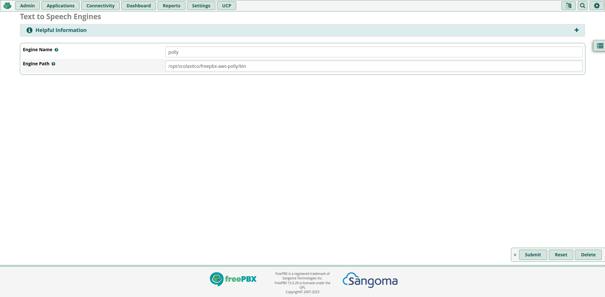

# FreePBX AWS Polly TTS Engine
[](https://github.com/scolastico/freepbx-aws-polly/blob/main/LICENSE)
[](https://github.com/scolastico/freepbx-aws-polly/graphs/contributors)
[](https://github.com/scolastico/freepbx-aws-polly/issues)

## About
This is a FreePBX TTS Engine for AWS Polly. It is based on the
[FreePBX TTS Engine](https://www.thewebmachine.net/wiki/freepbx-general/installing-aws-polly-tts-better-picotts-alternative) from [The Web Machine](https://www.thewebmachine.net/).
I updated the code to work with the aws sdk v3 (as v2 is no
longer supported), packaged it with a 'new' version of nodejs
(16) and added some new features.

### Just want to use it?
See the **step-by-step guide** in the **[wiki](https://github.com/scolastico/freepbx-aws-polly/wiki)**.

## Features
- [x] AWS Polly TTS Engine
- [x] Multi Language Support
- [x] Multi Voice Support
- [x] Prefix and Suffix Support

## Installation
*For beginners: see the **step-by-step guide** in the **[wiki](https://github.com/scolastico/freepbx-aws-polly/wiki)**.*

Login to your FreePBX Server and run the following command:
```bash
curl -s https://raw.githubusercontent.com/scolastico/freepbx-aws-polly/main/install.sh | bash
```

## Configuration
After the installation you can configure the
`/opt/scolastico/freepbx-aws-polly/config.json` file.

See the [`defaultConfig.json`](./src/defaultConfig.json) for reference.

You can find the available voices [here](https://docs.aws.amazon.com/polly/latest/dg/voicelist.html).

You should create a IAM user with the following
permissions:
```json
{
    "Version": "2012-10-17",
    "Statement": [
        {
            "Sid": "Stmt1234567890",
            "Effect": "Allow",
            "Action": [
                "polly:SynthesizeSpeech"
            ],
            "Resource": [
                "*"
            ]
        }
    ]
}
```

## FreePBX Configuration
After the installation you can configure the TTS Engine
in the FreePBX GUI.

Settings -> Text to Speech Engines -> Add TTS Engine

Engine name: `polly`
Engine path: `/opt/scolastico/freepbx-aws-polly/bin`



## Usage
If you want to use a different voice or language you can use a `!<presets as csv>`
before your text. You can chain multiple presets which will overwrite already set
variables For example:
```bash
!en Hello World!
```
or
```bash
!de,2-seconds-silence Hello World!
```

## Troubleshooting
If something does not seem to work, check the log files:

```bash
tail -f /opt/scolastico/freepbx-aws-polly/logs/combined.log
```

If this does not help, you are always welcome to open an
[issue](https://github.com/scolastico/freepbx-aws-polly/issues).

## Update
Just run the [installation](#installation) again.

## Development
You need to install the following packages:
```bash
sudo apt install nodejs npm lame
```

Then install the dependencies:
```bash
pnpm install
```

## License
This project is licensed under the **Apache License 2.0**.

### About
Apache-2.0
A permissive license whose main conditions require preservation
of copyright and license notices. Contributors provide an express
grant of patent rights. Licensed works, modifications, and larger
works may be distributed under different terms and without source
code.

### What you can do
| Permissions                                                                                                                       | Conditions                                                                                                                                                   | Limitations                                                                                                                                                                                                                      |
|-----------------------------------------------------------------------------------------------------------------------------------|--------------------------------------------------------------------------------------------------------------------------------------------------------------|----------------------------------------------------------------------------------------------------------------------------------------------------------------------------------------------------------------------------------|
| <details><summary>🟢 Commercial use</summary>The licensed material and derivatives may be used for commercial purposes.</details> | <details><summary>🔵 License and copyright notice</summary>A copy of the license and copyright notice must be included with the licensed material.</details> | <details><summary>🔴 Liability</summary>This license includes a limitation of liability.</details>                                                                                                                               |
| <details><summary>🟢 Distribution</summary>The licensed material may be distributed.</details>                                    | <details><summary>🔵 State changes</summary>Changes made to the licensed material must be documented.</details>                                              | <details><summary>🔴 Trademark use</summary>This license explicitly states that it does NOT grant trademark rights, even though licenses without such a statement probably do not grant any implicit trademark rights.</details> |
| <details><summary>🟢 Modification</summary>The licensed material may be modified.</details>                                       |                                                                                                                                                              | <details><summary>🔴 Warranty</summary>This license explicitly states that it does NOT provide any warranty.</details>                                                                                                           |
| <details><summary>🟢 Patent use</summary>This license provides an express grant of patent rights from contributors.</details>     |                                                                                                                                                              |                                                                                                                                                                                                                                  |
| <details><summary>🟢 Private use</summary>The licensed material may be used and modified in private.</details>                    |                                                                                                                                                              |                                                                                                                                                                                                                                  |

*Information provided by https://choosealicense.com/licenses/apache-2.0/*

Read more [here](https://github.com/scolastico/freepbx-aws-polly/blob/main/LICENSE).
